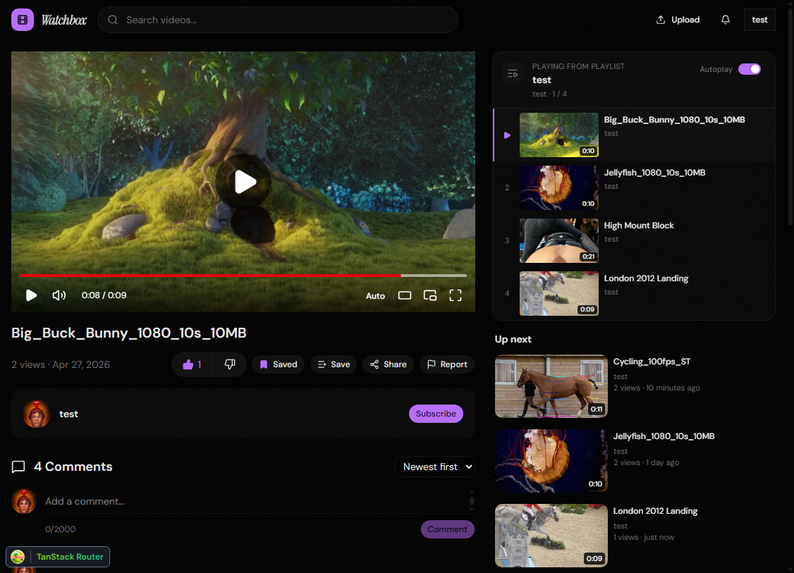

# Watchbox



## Features

- Video playback with up-next recommendations and playlist autoplay
- Categories, search, and comments
- Authentication via Better-Auth
- React + TanStack Start frontend, Hono API, PostgreSQL + Drizzle ORM
- Monorepo managed with Turborepo and pnpm

## Local development

### Requirements

- [Bun](https://bun.sh/) 1.3 or newer
- [pnpm](https://pnpm.io/) 10.32.1 (`corepack enable` installs the version pinned by the repository)
- Docker and Docker Compose
- `ffmpeg` and `ffprobe` on your `PATH` for the worker

### Start the application

```bash
pnpm install
pnpm docker:up
mkdir -p storage
cp apps/web/.env.example apps/web/.env
cp apps/server/.env.example apps/server/.env
cp apps/worker/.env.example apps/worker/.env
```

Set `STORAGE_PATH` in both `apps/server/.env` and `apps/worker/.env` to the absolute path of this checkout's `storage` directory. Generate and set the same secret in both files:

```bash
openssl rand -base64 48
```

Then apply the checked-in migrations and start all three processes:

```bash
pnpm db:migrate
pnpm dev
```

`pnpm db:migrate` is the normal path for an existing database. `pnpm db:push` is useful during local schema development, but should not be used against production.

Web: http://localhost:3001 · API: http://localhost:3000

## Coolify deployment

Deploy the complete application as one Docker Compose service stack. The Compose file starts PostgreSQL, Redis, migrations, API, worker, and web frontend on its own private network. Only the web frontend and API need public domains.

### Create the stack

1. Create a new **Service Stack** in Coolify from this repository.
2. Select `docker-compose.coolify.yml` as the Compose file.
3. Add the values from `.env.coolify.example` to the stack environment variables. Coolify detects the referenced variables from the Compose file.
4. Set the Web domain to `https://watch.example.com:3001` and the Server domain to `https://api.example.com:3000`. The ports tell Coolify the internal container ports; visitors use standard HTTPS.
5. Deploy the stack. `migrate` waits for PostgreSQL, runs the checked-in Drizzle migrations, exits, and then unblocks the API and worker.

The first deployment creates three named persistent volumes:

- `postgres-data` for the database
- `redis-data` for queue persistence
- `media-data`, mounted at `/data` in both API and worker

`media-data` is shared because the API writes uploads and the worker creates thumbnails and transcodes. Do not expose PostgreSQL, Redis, the worker, or the migration service publicly.

### Build variables

These Compose environment variables are passed as build arguments and embedded in the browser build, so use public URLs only.

```text
VITE_SERVER_URL=https://api.example.com
VITE_WEB_URL=https://watch.example.com
VITE_APP_NAME=Watchbox
```

### Required secrets

Set the following in Coolify. Use passwords without URL-reserved characters because they are used in internal connection URLs.

```text
POSTGRES_PASSWORD=<long random password without URL-reserved characters>
REDIS_PASSWORD=<long random password without URL-reserved characters>
BETTER_AUTH_SECRET=<output of openssl rand -base64 48>
```

Attach domains and enable HTTPS before the first deployment, because `VITE_SERVER_URL` and `VITE_WEB_URL` are fixed at build time. The API image health check requests `GET /` on port `3000` and expects `200 OK`.

## Operations

- Back up both the PostgreSQL database and the shared `/data` volume. The database contains metadata; `/data` contains uploads, streams, thumbnails, avatars, and resumable-upload state.
- Keep the API and worker deployment counts at one unless the storage volume supports concurrent read/write access across replicas.
- To rotate the auth secret safely, deploy API and worker together with the new shared value. Existing sessions will be invalidated.
